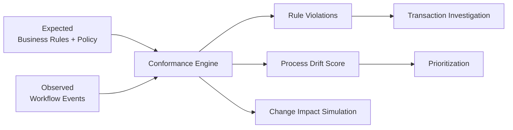
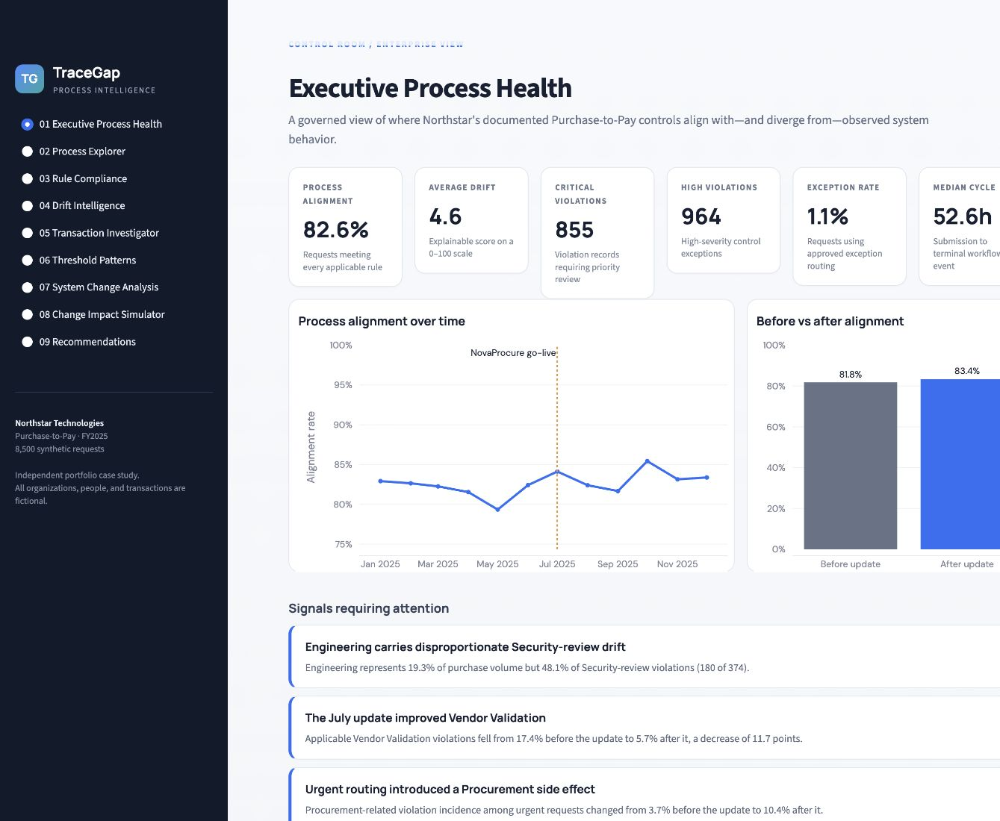
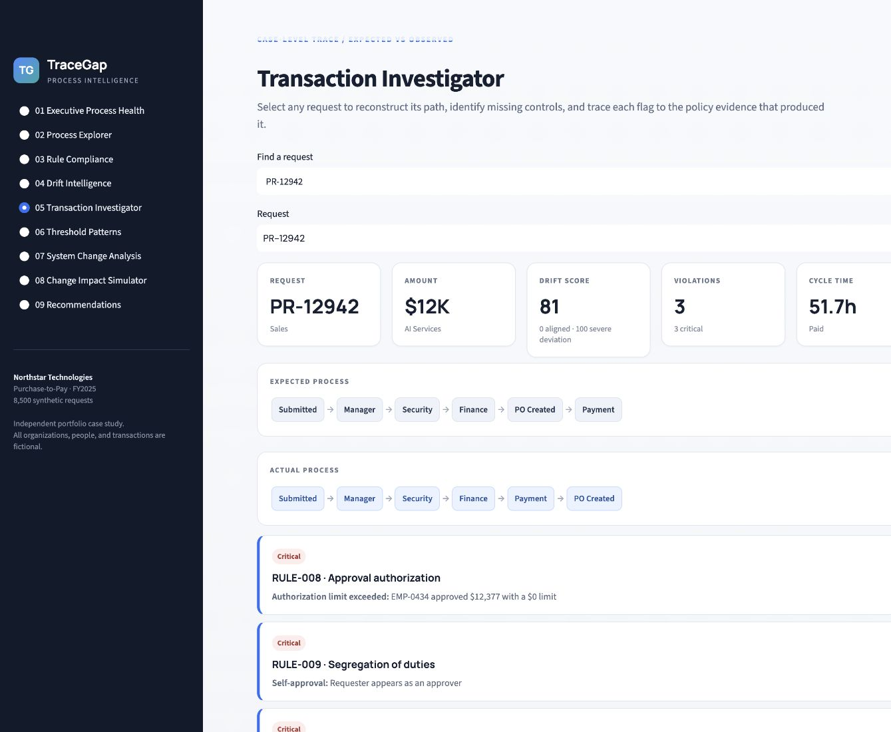
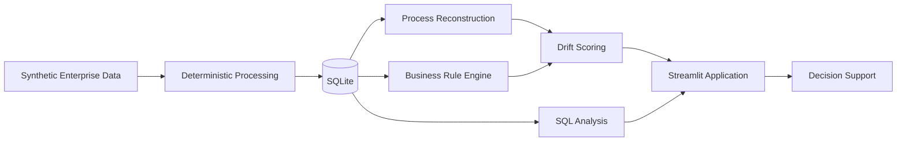

# TraceGap

**Business Process Drift & Change Impact Intelligence**

TraceGap is a business systems intelligence platform that compares documented business rules with observed workflow behavior to identify process drift, surface control gaps, investigate unusual transaction patterns, and evaluate the historical impact of proposed policy changes.

> **Synthetic-data demonstration using a fictional company. No production outcomes or ROI are claimed.**

## Overview

Large organizations define how purchasing processes *should* operate through approval policies, authorization thresholds, risk controls, and application workflows.

In practice, system changes, local workarounds, exceptions, and inconsistent adoption can create a gap between the documented process and what actually happens.

TraceGap was built around one question:

**Are our systems actually enforcing the process we designed?**

The platform converts **18 business policies into executable rules** and reconstructs **8,500 Purchase-to-Pay workflows from 44,862 system events** to compare expected and observed process behavior.

### Key Metrics

| Metric | Result |
|---|---:|
| Process Alignment Rate | **82.61%** |
| Critical Rule Compliance | **92.42%** |
| Average Process Drift Score | **4.56 / 100** |
| Rework Rate | **5.14%** |
| Median Approval Cycle Time | **52.64 hours** |
| Threshold-Review Clusters | **12** |

---

## What TraceGap Does

TraceGap combines business rules, workflow events, and transaction data into an explainable process-intelligence system.



The system:

- Converts documented policies into structured business rules.
- Reconstructs the actual workflow path of each purchase request.
- Compares expected and observed process behavior.
- Retains rule-level evidence for identified violations.
- Calculates an explainable Process Drift Score.
- Identifies transactions that may require human review.
- Evaluates the effects of a system release.
- Simulates how proposed business-rule changes would have affected historical workflows.

---

## Key Findings

### Vendor controls improved after the system update

Applicable Vendor Validation violations decreased from **17.4% before release to 5.7% after release**, an improvement of 11.7 percentage points.

### The release also introduced an operational tradeoff

Urgent Procurement-related violations increased from **3.7% before go-live to 10.4% afterward**, suggesting that an improvement in one area may have created unintended effects elsewhere in the process.

### Security-review drift was concentrated

Engineering represented **19.3% of total request volume but 48.1% of Security-review violations**, accounting for 180 of 374 identified violations.

These findings are generated from synthetic data and demonstrate the analytical method rather than actual organizational performance.

---

## Application

TraceGap includes nine interactive decision-support areas.

### 1. Executive Process Health

Provides an enterprise-level view of:

- process alignment
- process drift
- rule violations
- exception rates
- rework
- cycle time
- automatically generated findings

### 2. Process Explorer

Allows users to investigate:

- common workflow paths
- process variants
- skipped steps
- rework
- departmental differences
- process complexity

### 3. Rule Compliance

Evaluates each business rule by:

- applicability
- violation count
- compliance rate
- severity
- affected transaction value
- supporting evidence

### 4. Drift Intelligence

Prioritizes process deviation using an explainable 0–100 score based on rule severity, process anomalies, rework, exceptions, and rare-path signals.

### 5. Transaction Investigator

Reconstructs individual requests and displays:

- expected workflow
- observed workflow
- missing process steps
- rule violations
- policy evidence
- event-level audit trail

### 6. Threshold Pattern Detection

Identifies repeated near-threshold transactions that may warrant additional human review.

The system treats these as **review indicators only** and does not infer intent or wrongdoing.

### 7. System Change Analysis

Evaluates the July 2025 system update by comparing:

- process alignment
- process drift
- unusual sequences
- approval-cycle time
- system adoption
- intended improvements
- unintended effects

### 8. Change Impact Simulator

Allows users to evaluate hypothetical policy changes such as:

- lowering the Finance approval threshold
- changing the Director approval threshold
- expanding Security review requirements

The simulator applies proposed rules to historical transactions and estimates:

- transactions affected
- workload change
- affected departments
- affected purchase categories
- estimated handling hours

These results represent **historical impact simulations**, not predictions of future behavior.

### 9. Recommendations

Connects analytical findings to:

**Evidence → Root-Cause Hypothesis → Recommendation → System Requirement → KPI**

---

## Screenshots

### Executive Process Health



### Transaction Investigator



---

## Process Drift Score

TraceGap uses an explainable 0–100 Process Drift Score to prioritize transactions for review.

The score combines:

- severity-weighted business-rule violations
- workflow ordering anomalies
- rework
- exception routing
- rare process-path signals

The score is intentionally transparent and rule-based rather than machine-learning based.

A high score indicates stronger deviation from the documented process and prioritizes the transaction for investigation.

---

## Change Impact Simulation

The Change Impact Simulator evaluates how proposed policy changes would have reclassified historical purchase requests.

Example scenarios include:

- What if Finance approval began at **$5,000 instead of $10,000**?
- What if the Director threshold increased from **$25,000 to $40,000**?
- What if Security review expanded to additional purchase categories?

Outputs include:

- reclassified historical transactions
- percentage of transactions affected
- estimated analyst workload
- impacted departments
- impacted purchase categories
- capacity warnings

The simulator supports policy and systems-change analysis without presenting historical reclassification as a forecast.

---

## System Architecture



Detailed AS-IS, TO-BE, architecture, and entity-relationship diagrams are available in:

[`docs/process_analysis.md`](docs/process_analysis.md)

---

## Technology

**Python / pandas / NumPy**  
Data generation, workflow reconstruction, business-rule evaluation, scoring, metrics, and change simulation.

**SQL / SQLite**  
Relational data model and 26 business-oriented analytical queries.

**Streamlit / Plotly**  
Interactive enterprise decision-support interface and visualizations.

**Mermaid / Markdown**  
Process models, architecture documentation, requirements, testing, and system documentation.

---

## Business Analysis & Requirements

TraceGap includes formal business-analysis documentation.

### Business Requirements Document

Defines:

- business objectives
- stakeholders
- project scope
- functional requirements
- non-functional requirements
- business rules
- assumptions
- constraints
- success metrics

[`docs/business_requirements.md`](docs/business_requirements.md)

### Requirements Traceability Matrix

Maps:

**Business Objective → Business Requirement → Functional Requirement → System Component → UAT Scenario**

[`docs/requirements_traceability_matrix.md`](docs/requirements_traceability_matrix.md)

### User Stories

Includes 15 user stories with acceptance criteria.

[`docs/user_stories.md`](docs/user_stories.md)

### User Acceptance Testing

Includes 15 UAT scenarios and KPI validation logic.

[`docs/uat.md`](docs/uat.md)

---

## Repository Structure

```text
tracegap/
├── app.py
│
├── data/
│   ├── raw/
│   ├── processed/
│   └── tracegap.db
│
├── docs/
│   ├── business_requirements.md
│   ├── requirements_traceability_matrix.md
│   ├── user_stories.md
│   ├── uat.md
│   ├── process_analysis.md
│   ├── recommendations.md
│   └── data_dictionary.md
│
├── images/
│
├── sql/
│   ├── schema.sql
│   └── analysis.sql
│
├── src/
│   ├── generate_data.py
│   ├── process_engine.py
│   ├── rule_engine.py
│   ├── drift_scoring.py
│   ├── threshold_detection.py
│   ├── change_simulator.py
│   ├── metrics.py
│   ├── database.py
│   └── pipeline.py
│
├── tests/
│
├── requirements.txt
└── README.md
```

---

## Running TraceGap Locally

TraceGap requires **Python 3.11+**.

### 1. Create a virtual environment

```bash
python -m venv .venv
```

### 2. Activate the environment

macOS/Linux:

```bash
source .venv/bin/activate
```

Windows:

```bash
.venv\Scripts\activate
```

### 3. Install dependencies

```bash
pip install -r requirements.txt
```

### 4. Rebuild the project data and database

```bash
python -m src.pipeline
```

### 5. Launch the application

```bash
streamlit run app.py
```

### Run validation tests

```bash
python -m unittest discover -s tests -v
```

The data-generation pipeline is deterministic, allowing the documented metrics to be reproduced using the default seed.

---

## Documentation

- [Business Recommendations](docs/recommendations.md)
- [Data Dictionary](docs/data_dictionary.md)
- [Process & Architecture Analysis](docs/process_analysis.md)
- [Business Requirements](docs/business_requirements.md)
- [Requirements Traceability Matrix](docs/requirements_traceability_matrix.md)
- [User Stories](docs/user_stories.md)
- [User Acceptance Testing](docs/uat.md)

---

## Limitations

TraceGap uses synthetic data and a fictional organization.

- Northstar Technologies and all employees, vendors, and transactions are fictional.
- Results demonstrate the system's methodology and code rather than actual organizational behavior.
- Root-cause hypotheses would require stakeholder interviews and system-configuration validation in a real implementation.
- Transaction values represent analytical exposure and should not be interpreted as financial loss, savings, or ROI.
- Threshold-pattern indicators identify transactions for review and do not establish wrongdoing.
- The local SQLite/Streamlit implementation does not include enterprise identity management, access controls, orchestration, or production case-management infrastructure.
