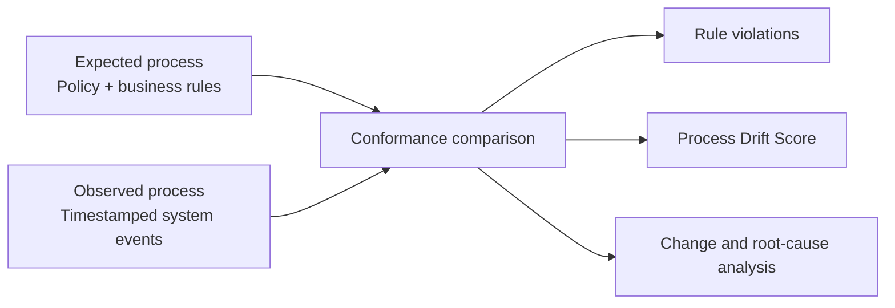
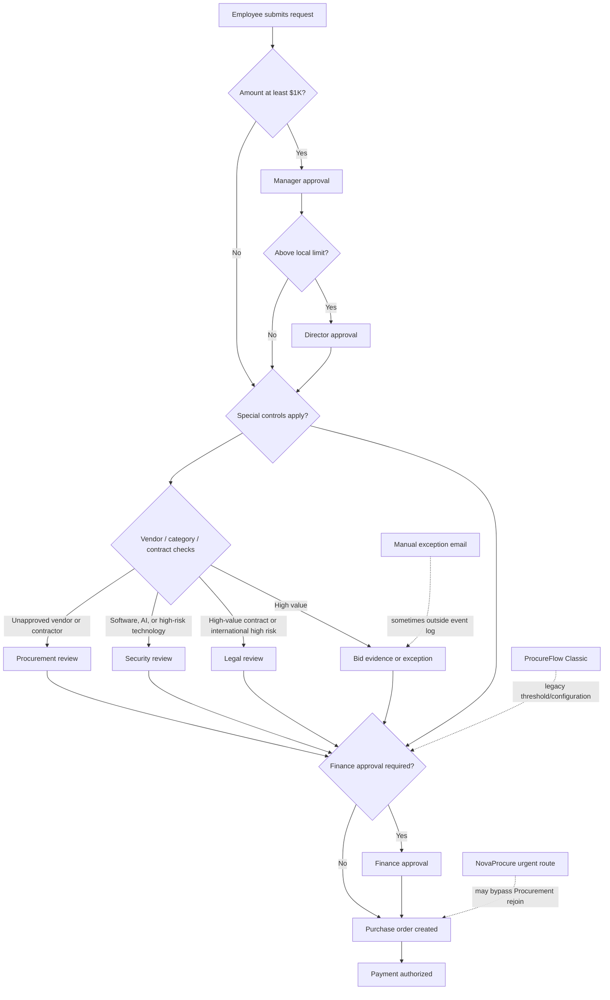
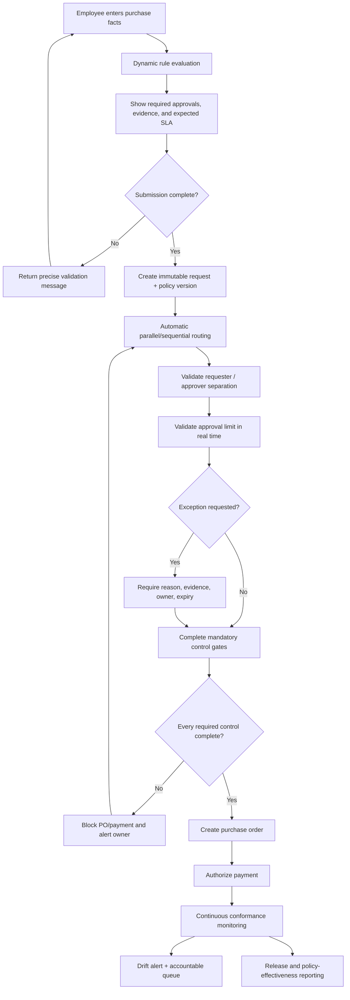
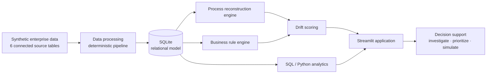
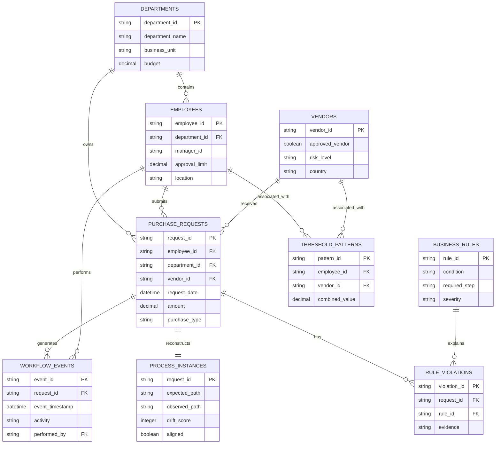

# Purchase-to-Pay Process Analysis

## Central analytical model

TraceGap treats policy and system behavior as two independently testable representations:

The expected path is constructed from request amount, category, vendor approval and risk, contract attributes, urgency, and effective date. The observed path is reconstructed by ordering every event for the request. A difference becomes a finding only when reusable logic can identify it and retain the rule and evidence that explain the result.

## AS-IS workflow

### AS-IS observations

- **Manual exceptions:** exception rationale may exist in email or attachments, while the event log only confirms that an exception activity occurred.
- **System limitation:** the legacy application does not consistently enforce Vendor Validation and continues to apply the former travel threshold in part of Austin.
- **Policy/system mismatch:** effective-dated policy can change independently of application configuration.
- **Approval bottleneck:** Legal and Security reviews add longer average inter-event time than routine routing.
- **Inconsistent enforcement:** Engineering technology intake, Marketing bid exceptions, Field Operations Procurement routing, and Revenue approval delegation show different drift patterns.
- **Release side effect:** the July update reduces Vendor Validation violations but increases Procurement-related violations for urgent work.

## TO-BE workflow

## AS-IS vs TO-BE

| Dimension | AS-IS | TO-BE |
|---|---|---|
| Rule evaluation | Distributed across policy, local practice, and application configuration | Versioned central rule service evaluates facts at submission |
| Routing | Mixed manual and application-specific branches | Generated from applicable controls with explicit joins after fast-track paths |
| Approval limits | Can be checked after approval or not at all | Real-time authorization check before approval is accepted |
| Segregation of duties | Delegated groups may allow requester overlap | Identity validation blocks requester self-approval |
| Effective dates | Policy and application changes can diverge | Policy version and effective date stored with each request |
| Exceptions | Rationale quality varies and may live outside the workflow | Structured reason, evidence, owner, expiry, and reporting |
| Downstream enforcement | PO/payment can occur with incomplete controls | Mandatory gate blocks PO and payment until controls are complete |
| Monitoring | Periodic sampling and retrospective analysis | Continuous conformance metrics and accountable drift queue |
| Change validation | Overall adoption metrics | Rule-, route-, office-, and application-level regression checks |

## Process Drift Score

The score is an explainable prioritization aid, not a prediction or machine-learning output.

| Component | Calculation | Maximum |
|---|---|---:|
| Rule violations | Low 4, Medium 8, High 14, Critical 22 points per violation | 65 |
| Ordering anomalies | 12 points per detected sequence issue | 20 |
| Rework | 5 points per return-for-revision loop | 10 |
| Exceptions | 3 points per exception event | 6 |
| Rare path | 4 points when path frequency is at or below the rarity threshold | 4 |
| Final score | Sum of components, capped | 100 |

The score does not state that a high-drift request is fraudulent or harmful. It ranks requests by observable deviation so a person can review the evidence.

## Temporal system change

NovaProcure went live on July 1, 2025. Synthetic behavior models two linked effects:

1. A required vendor gate improves Vendor Validation compliance.
2. An urgent fast-track route can fail to rejoin the mandatory Procurement branch.

Legacy traffic remains disproportionately visible in Austin, where a subset of travel requests still follows the former $7,500 Finance threshold instead of the new $5,000 threshold. TraceGap separates policy design, application behavior, and office adoption so an overall post-release metric cannot hide those differences.

## System architecture

## Entity-relationship model

## Analysis limitations

- The event log shows what the synthetic applications recorded, not off-system communication or attachment quality.
- Parallel approvals are represented in a linear timestamp sequence for interpretability.
- Rule applicability is tailored to this case study and would require policy-owner validation in a real organization.
- Root-cause statements are hypotheses; workshops, configuration review, and user research would be required to confirm them.

